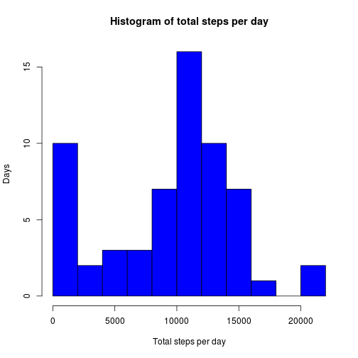

# Reproducible Research: Peer Assessment 1

## Loading and preprocessing the data

```r
my_data <- read.csv("activity.csv", header = TRUE, sep = ",", stringsAsFactors = FALSE)
my_data$steps <- as.numeric(my_data$steps)
my_data$date  <- as.Date(my_data$date)
my_data$interval <- as.numeric(my_data$interval)
```

## What is mean total number of steps taken per day?

```r
dailyTotal <- sapply(split(my_data$steps, my_data$date), function(x) sum(x,na.rm=T))
hist(dailyTotal, main = "Histogram of total steps per day", xlab = "Total steps per day", ylab = "Days", 
    col = "blue",breaks=10)
```

 

```r
my_mean<-mean(dailyTotal)
my_median<-median(dailyTotal)
```
- The mean is 9354.2295 and median 1.0395 &times; 10<sup>4</sup>

## What is the average daily activity pattern?

```r
average_dailypat <- sapply(split(my_data$steps, my_data$interval), function(x) mean(x,na.rm=T))
plot(as.numeric(names(average_dailypat)), average_dailypat, type = "l", main = "Average daily activity patern", xlab = "5 minutes interval", 
    ylab = "Mean steps during interval",col="green")
```

 

```r
my_interval<-names(average_dailypat[average_dailypat == max(average_dailypat)])
```
- The 5-minute interval, on average across all the days in the dataset, containing the maximum number of steps is 835 

## Inputing missing values

```r
my_missing_values<-nrow(my_data[is.na(my_data$steps), ])
```
- The total number of missing values in the dataset is 2304
- The missign values will be filled in with the mean.


```r
average_steps <- sapply(split(my_data$steps, my_data$interval), function(x) x[is.na(x)] <- as.integer(mean(x[!is.na(x)])))

for (i in 1:nrow(my_data)) {
    if (is.na(my_data[i, "steps"])) {
        my_data[i, "steps"] <- average_steps[as.character(my_data[i, "interval"])][[1]]
    }
}

dailyTotal <- sapply(split(my_data$steps, my_data$date), function(x) sum(x))
hist(dailyTotal, main = "Histogram of total steps per day", xlab = "Total steps per day", ylab = "Days", 
    col = "red",breaks=10)
```

 

```r
my_new_mean<-mean(dailyTotal)
my_new_median<-median(dailyTotal)
```
- Imputing missing data on the estimates of the total daily number of steps changes the mean (from 9354.2295 to 1.075 &times; 10<sup>4</sup>) and median (from 1.0395 &times; 10<sup>4</sup> to 1.0641 &times; 10<sup>4</sup>). 

## Are there differences in activity patterns between weekdays and weekends?

```r
day <- as.vector(character())
for (i in 1:nrow(my_data)) {
    tmp <- my_data[i, c("steps", "date", "interval")]
    day <- append(day, weekdays(tmp$date))
    if (identical(day[i], "Sunday")) {
        day[i] <- "Weekend"
    } else {
        if (identical(day[i], "Saturday")) {
            day[i] <- "Weekend"
        } else {
            day[i] <- "Weekday"
        }
    }
}
my_data <- cbind(my_data, day)

library("lattice")
xyplot(steps ~ interval | day, data = my_data, layout = c(1, 2), type = "l", 
    xlab = "Interval", ylab = "Number of steps")
```

 
